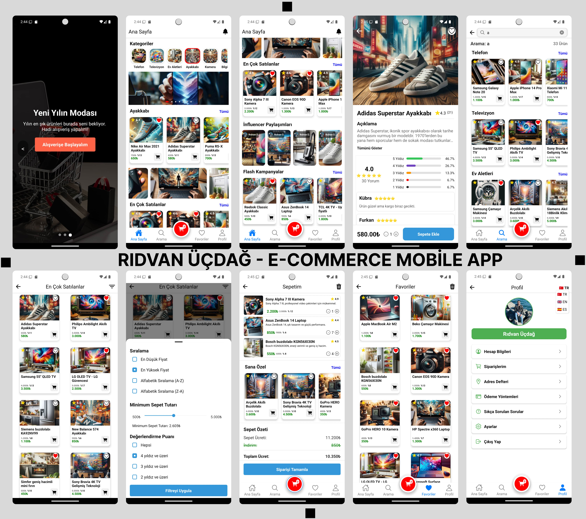

# Yeni Mobil Proje

Yeni bir tasarım daha hazırladım ve geçen hafta boşluğumda bu tasarımı kodladım. Böylece bir haftamı daha dolu dolu bu projeyi kodlayarak değerlendirmiş oldum. Bu da benim ikinci GitHub mobil projem oldu! Hatırlarsanız eğer ilkini 5 ay önce yayınlamıştım 🙂 

**Not:** Windows bilgisayar ile kodlama yaptığım için IOS tarafında tasarım bozuklukları olabilir. IOS tarafını maalesef kontrol edemedim.

## Kullanılan Teknolojiler
- React Native
- Redux
- TypeScript

Projede Türkçe, İngilizce ve İspanyolca olmak üzere 3 dil desteği mevcut.

## Bu Bağlantılardan bana ulaşabilirsiniz
- [Instagram](https://www.instagram.com/ridvan_ucdag)
- [LinkedIn](https://www.linkedin.com/in/ridvanucdag)

## Proje Ekran Görüntüleri

  
---